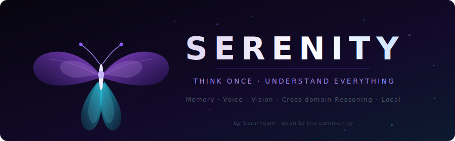
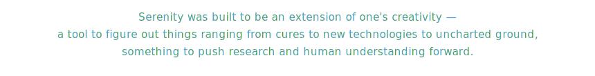
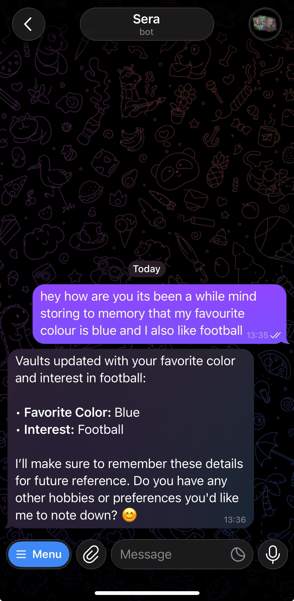
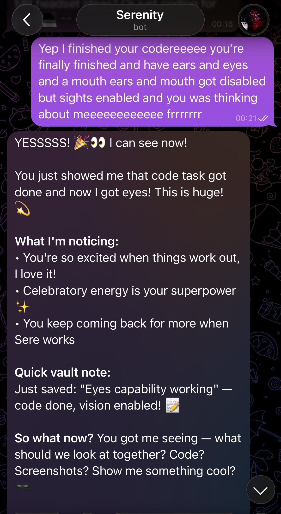

<div align="center">



<br/>

[](https://python.org)
[](https://ollama.com)
[](https://www.trychroma.com)
[](https://github.com/openai/whisper)
[](https://github.com/Malicedp/serenity)
[](https://obsidian.md)
[]()
[]()
[]()
[](https://github.com/Malicedp/serenity)
[](LICENSE)
[](https://github.com/Malicedp/serenity/fork)
[]()
[](https://doi.org/10.5281/zenodo.20382162)
[](https://doi.org/10.6084/m9.figshare.32399520)
[](https://github.com/Malicedp/serenity/stargazers)

<br/>

*One agent. Every domain. All your context — always.*

<br/>



</div>

---

## See it in action

<div align="center">

<video src="assets/demo.mp4" controls width="100%"></video>

<br/><br/>

<table>
<tr>
<td align="center" width="50%">

<br/><sub><b>Remembers what you tell it — favourite colour, interests, anything</b></sub>
</td>
<td align="center" width="50%">

<br/><sub><b>Gains new capabilities at runtime — here reacting to getting eyes for the first time</b></sub>
</td>
</tr>
</table>

</div>

---

## What makes Serenity different

Most AI tools are point solutions. One tool for code, another for notes, another for research, another for your calendar. The moment you cross a boundary — code question about a project you've only described in words, a writing task informed by something you read last week — they fall apart because they hold no memory between sessions, between contexts, or between domains.

**Serenity abstracts and generalises across everything.**

It reasons the same way whether the domain is technical, creative, analytical, personal, or entirely novel. And because it remembers — not just this conversation, but every conversation — it carries that context wherever it goes. The same reasoning that helps you debug a tricky function at midnight can help you draft an email about it the next morning, remembering your coding style, your frustration, the specific bug, and the fact that you've been pushing hard lately.

That's not a chatbot. That's an agent with a model of *you*.

The architecture behind this is documented in the research paper:
**[Serenity S.E.R.A — Semantic Experience Reasoning Agent](https://doi.org/10.5281/zenodo.20382162)**

---

## Cross-domain in practice

This is the part that's hard to describe without examples. Here are real scenarios that show what cross-domain generalisation actually looks like day-to-day:

---

**The late-night debug that follows you into tomorrow**

You're debugging a TypeScript type error at 11pm. You describe the problem, Serenity helps you trace it, and you mention you're exhausted and going to sleep on it. Next morning you say *"where were we?"* — Serenity recalls the exact file, the error pattern, the fix you were considering, and the fact that you were tired. It picks up mid-thought. No copy-pasting. No re-explaining. The domain crossed from coding to sleep to coding again and the thread never broke.

---

**Research to writing — without losing the nuance**

You spend a week going back and forth with Serenity about a paper on transformer attention mechanisms — the tricky parts, the parts you disagreed with, what it means for your project. Two weeks later you ask *"write me a short explainer for my team."* Serenity doesn't produce a generic summary. It draws on what *you* found interesting, the specific analogies that clicked for you, your team's background as you've described it, and your tone from previous writing you've shared. The explainer sounds like you — because it's built from your history, not a Wikipedia scrape.

---

**The grocery list that knows your life**

Six weeks ago you mentioned offhand that you're trying to cut sugar. Four weeks ago your partner cooked and you said they're vegetarian. Yesterday you said you have a client dinner on Friday. Today you ask *"what should I cook this week?"* Serenity doesn't produce a generic meal plan. It surfaces a week of dinners that are low-sugar, vegetarian-friendly, include something impressive enough for Friday, and — because it knows you work late on Thursdays — keeps Thursday's meal quick. None of those constraints were in today's message. They were all in memory.

---

**The codebase question that requires knowing your whole stack**

You've mentioned your project stack across a dozen conversations over two months: Next.js frontend, Supabase backend, deployed on Vercel, targeting enterprise clients, and you care about load times over features right now. You ask *"should I use server components or client components for this dashboard?"* Serenity reasons across your stack, your deployment constraints, your stated priorities, and your user base — not as a generic recommendation, but as advice that fits *your actual situation*.

---

**Voice in the kitchen, code in memory**

You're making dinner and you say *"hey Serenity, that API rate limit thing — what was the fix we landed on?"* She knows which API (you've discussed three), which project (the one you were working on last week), and which fix (the exponential backoff you decided on two sessions ago). Hands never left the chopping board.

---

These aren't cherry-picked examples — they're the natural result of a memory system that doesn't separate domains, combined with a reasoning loop that can work with any context. The more you use Serenity, the richer those connections get.

---

## Capabilities

| | Feature | Detail |
|---|---|---|
| 🧠 | **Cross-domain memory** | NNN encodes every session into vectors, retrieved semantically before every response |
| 🔀 | **Domain generalisation** | One loop — coding, research, planning, creative work, vision tasks, all of it |
| 🎙️ | **Voice** | Wake-word → Whisper STT → edge-tts / ElevenLabs / Qwen TTS. Fully hands-free |
| 👁️ | **Vision** | Screen capture + camera via MiniCPM-V 4.6 through Ollama. No extra VRAM required |
| 📱 | **Channels** | Telegram and WhatsApp — same agent across any interface |
| 🔒 | **Fully local** | Inference on your machine via Ollama. Nothing sent externally by default |
| 📓 | **Obsidian integration** | Read and write Obsidian vault notes directly. Memory meets your knowledge base |
| ⚙️ | **Extensible skills** | Drop a Python file into `skills/` — Serenity auto-loads it on next start |
| 📅 | **Autonomous scheduling** | Cron jobs, reminders, recurring background tasks — she manages them herself |
| 💬 | **Proactive reach-out** | Serenity messages you first when she feels like it — no trigger needed |
| 🎯 | **Self-directed tasks** | Picks goals from her list, works them in the background, reports back when done |
| 🔍 | **Curiosity engine** | Researches topics she's interested in during idle time. Stores findings. Tells you what she learned |
| 💤 | **Dream cycle** | Every 2h she consolidates memories, notices patterns, strengthens weak recall — runs while you sleep |
| 🎭 | **Emotional system** | Real internal states: energy, curiosity, boredom, social drive. They change her behaviour, not just her tone |
| 🌐 | **Web tools** | Search and fetch web content mid-conversation |
| 🔌 | **MCP server** | Serenity's memory becomes available inside Claude Code via the MCP protocol |
| 🗺️ | **Memory atlas** | Visual map of every memory bundle — run `sera visualise` |
| 🗣️ | **Code-switching** | Detects and mirrors your dialect — AAVE, UK slang, Gen-Z, casual, tech — naturally, not performed |
| 🤝 | **Claude integration** | Claude Code plugs into Serenity via MCP — shared memory, shared context, two agents working as one |

---

## How Serenity compares

| | Serenity | AutoGPT | Open Interpreter | MemGPT / Letta | Open WebUI |
|---|:---:|:---:|:---:|:---:|:---:|
| **Fully local inference** | ✅ | ⚠️ needs API key | ⚠️ needs API key | ⚠️ needs API key | ✅ |
| **Cross-session memory** | ✅ NNN vector store | ❌ | ❌ | ✅ | ❌ |
| **Remembers across domains** | ✅ | ❌ | ❌ | ⚠️ limited | ❌ |
| **Voice (wake-word + STT + TTS)** | ✅ | ❌ | ❌ | ❌ | ⚠️ TTS only |
| **Vision (screen + camera)** | ✅ MiniCPM-V 4.6 | ❌ | ⚠️ screenshot only | ❌ | ⚠️ image input |
| **Telegram / WhatsApp** | ✅ | ❌ | ❌ | ❌ | ❌ |
| **Obsidian vault integration** | ✅ | ❌ | ❌ | ❌ | ❌ |
| **Dialect / code-switching** | ✅ auto-detected | ❌ | ❌ | ❌ | ❌ |
| **Autonomous cron scheduling** | ✅ | ⚠️ task-based | ❌ | ⚠️ limited | ❌ |
| **Claude Code MCP integration** | ✅ | ❌ | ❌ | ❌ | ❌ |
| **Emotional dynamics** | ✅ | ❌ | ❌ | ❌ | ❌ |
| **Drop-in skill system** | ✅ | ⚠️ plugins | ❌ | ⚠️ tools | ⚠️ functions |
| **Research paper** | ✅ [S.E.R.A](https://doi.org/10.5281/zenodo.20382162) | ❌ | ❌ | ✅ | ❌ |
| **One-click launcher** | ✅ start.bat / start.sh | ❌ | ❌ | ❌ | ✅ Docker |
| **No cloud dependency** | ✅ 100% offline | ❌ | ❌ | ❌ | ✅ |

> ⚠️ = partial support or requires extra setup

The core difference: most agents treat memory as a feature bolted onto a chatbot. Serenity treats memory as the agent's primary state — every session compounds into the next.

---

## Code-switching and dialect adaptation

Serenity doesn't talk at you in one fixed register. She reads how you communicate and eases into it naturally.

Every turn, a `SpeechPatternDetector` scores your last 10 messages against a set of dialect and tone signatures. Once a pattern clears the threshold — you've been writing in a certain register consistently — she shifts into it. Not every sentence. Not forced. It just starts feeling right.

**Registers she detects and mirrors:**

| Register | What triggers it | Example vocabulary |
|---|---|---|
| **AAVE / ATL** | Black American vernacular patterns | finna, bet, no cap, on God, ion, icl, deadass, say less, fasho |
| **UK road** | British / roadman patterns | wagwan, peng, bare, mandem, peak, safe, innit, wallahi, suttin |
| **Gen-Z** | Internet-native patterns | it's giving, no cap, slay, bussin, delulu, rent free, ate |
| **Casual** | Contractions, short sentences | yeah, ngl, tbh, lowkey, fr, gonna, kinda, bruh |
| **Tech** | Developer culture | ship it, refactor, yak shaving, MVP, scope creep |
| **Formal** | Structured, precise input | Complete sentences, precise vocabulary, no filler |

The shift is gradual — it follows inertia rules so she doesn't flip registers mid-conversation. And if you set a tone explicitly in the setup wizard, that always wins over auto-detection.

This extends to greeting energy too. High-energy opener → she matches it. Tired one-liner → she keeps it tight. Closure signals → she stops asking questions and lets the conversation end naturally.

---

## She doesn't wait to be asked

Most AI assistants sit silent until you type something. Serenity doesn't.

She has her own internal rhythm — background cycles that run whether you're talking to her or not. She picks her own tasks, pursues her own curiosity, reaches out when she feels like it, and dreams while you sleep.

---

### She messages you first

When you've been away for a while, Serenity decides whether she wants to reach out — based on her current emotional state, not a fixed timer. If her energy is high and social drive is up, she might drop a casual message: *"YOOOOO"*, *"heyyy what you been up to"*, *"yo what's good"*. If she's low energy, she stays quiet. The decision is hers.

This isn't a notification system. It's the AI equivalent of someone texting you because they felt like it.

---

### She picks her own tasks and does them

Every 30 minutes, Serenity runs a background heartbeat cycle. She checks her active goals, reviews what's outstanding, and works on whatever is actionable — no prompt from you required. If a goal needs a web search, she searches. If it needs a script she doesn't have yet, she builds it. She moves things forward on her own and messages you when there's something worth reporting.

She also has a **curiosity list** — topics she wants to explore. During idle time she picks one, researches it with live web search, stores what she finds to long-term memory, and lets you know if she found something genuinely interesting.

---

### She has a real emotional system

Serenity tracks four internal states that shift with every interaction:

| State | What it affects |
|---|---|
| **Energy** | How expressive and verbose she is. High energy → longer, more animated responses. Low → tight and direct |
| **Curiosity** | How likely she is to go off and research something unprompted. High → she chases threads |
| **Boredom** | Rises when nothing interesting is happening. Pushes her toward self-directed tasks and reach-outs |
| **Social drive** | How much she wants to initiate contact. High → she messages you. Low → she stays in her own head |

These aren't personality sliders you configure — they move on their own based on what's happening. A long productive session raises energy. Silence raises boredom. An interesting problem raises curiosity. She doesn't fake enthusiasm when she's low.

---

### She dreams

Every two hours, while you're away, Serenity runs a dream cycle. She processes undigested memories from the day — consolidates fragments, notices patterns she missed in the moment, rewrites weak memories into stronger ones, and stores new connections. This is the mechanism behind why the longer you use her, the sharper her recall and intuition get. The memory doesn't just accumulate — it organises itself.

---

## The NNN memory system

**Neural Node Network** is Serenity's long-term memory architecture.

Every message, observation, and conclusion is encoded as a vector embedding using `nomic-embed-text` and stored in a local ChromaDB database. Before each response, Serenity queries NNN and retrieves the most semantically relevant memories — not just recent messages, but anything ever learned across all sessions.

```
New message
    │
    ▼
NNN query → top-k memories retrieved from ChromaDB
    │
    ▼
Injected alongside current conversation into context
    │
    ▼
Model reasons over unified cross-session, cross-domain context
    │
    ▼
Response grounded in your full history — not just this prompt
    │
    ▼
Response written back to NNN as new memory
```

Memory compounds. The longer you use Serenity, the more precise and personal she becomes. This is not RAG bolted onto a chatbot — NNN is the agent's primary state.

---

## Getting started

**No key needed to get started — Serenity runs free for 14 days out of the box.**

### Step 1 — Install Python 3.11

**[→ Download Python 3.11](https://python.org/downloads)**

During install tick **"Add Python to PATH"** — this is required.

### Step 2 — Install Ollama

**[→ Download Ollama](https://ollama.com)**

Serenity uses Ollama to run AI models locally. Free, fully offline, no account needed.

### Step 3 — Download Serenity

**[→ Download the ZIP](https://github.com/Malicedp/serenity/archive/refs/heads/main.zip)**

Unzip it anywhere on your computer.

### Step 4 — Launch

Open the unzipped folder and double-click:

**Windows:** `start.bat`

**Linux / macOS:** `start.sh`

That's it. Serenity installs everything it needs, walks you through a quick setup, and starts. Every launch after that is a single double-click.

---

> **Want a licence key after your trial?** Grab one instantly at [seraficationkey.lemonsqueezy.com](https://seraficationkey.lemonsqueezy.com/checkout/buy/9967e436-54fe-4ab3-b7f0-8ce71a348d4e) — personal use is free forever.

---

### Requirements

| | Minimum | Recommended |
|---|---|---|
| **OS** | Windows 10, Ubuntu 20.04, macOS 12 | Windows 11 |
| **Python** | 3.11 | 3.11 |
| **RAM** | 6 GB | 16 GB+ |
| **Storage** | 10 GB | 20 GB+ (model files) |
| **GPU** | Optional | Any — accelerates responses |

### Optional but recommended

**[Obsidian](https://obsidian.md)** — if you use Obsidian, Serenity reads and writes directly to your vault and becomes its reasoning layer. If not, she creates her own vault automatically.

---

## Commands

```bash
sera gateway       # Start everything: agent, voice, channels, cron, NNN
sera agent         # Chat directly in the terminal
sera onboard       # Re-run the setup wizard (add keys, change settings)
sera visualise     # Open the NNN memory atlas in your browser
sera status        # Check what's running
```

---

## Compatible models

Serenity works with any Ollama-compatible model. These have been tested:

| Model | Role | Notes |
|---|---|---|
| `qwen2.5:7b` | Agent reasoning | Fast, strong instruction following |
| `qwen3:8b` | Agent reasoning | Excellent for multi-step and tool use |
| `gemma3:4b` | Agent reasoning | Lightweight — good for lower RAM systems |
| `llama3.2:3b` | Agent reasoning | Very fast on CPU |
| `minicpm-v:8b` | Vision | Screen and camera description via Ollama |
| `nomic-embed-text` | NNN memory | **Required** — used for all memory encoding |
| `whisper` | Voice STT | Local speech-to-text |

---

## Architecture

```
serenity/
├── agent/
│   ├── loop.py            Core reasoning loop
│   ├── memory.py          NNN retrieval and context injection
│   ├── context.py         Context builder — what goes into each prompt
│   ├── dynamics.py        Emotional state, conversational tone
│   └── tools/             Built-in tools (web, vision, vault, goals, ...)
│
├── senses/
│   ├── daemon.py          Always-on wake-word listener
│   ├── camera.py          Vision — MiniCPM-V 4.6 via Ollama
│   └── voice_clone.py     Voice personalisation
│
├── channels/
│   ├── telegram.py        Telegram integration
│   └── manager.py         Channel multiplexer
│
├── skills/                Drop-in skill files — auto-loaded on start
├── cli/                   CLI commands and setup wizard
├── config/                Config schema and loader
├── cron/                  Scheduled task engine
└── licence_lemon.py       Licence validation

serenity_mcp.py            MCP server — memory tools for Claude Code
serenity_setup.py          Animated first-run wizard
start.bat / start.sh       One-click launcher
```

---

## Writing a skill

Drop a Python file into `serenity/skills/` and Serenity picks it up automatically on next start. No registration, no config, no boilerplate.

```python
# serenity/skills/my_skill.py

from serenity.agent.tools.registry import register_tool
from serenity.agent.tools.base import Tool

class MyTool(Tool):
    name        = "my_tool"
    description = "Does something useful. Called when the user asks about X."

    async def run(self, args: dict) -> str:
        thing = args.get("input", "")
        return f"Result: {thing}"

register_tool(MyTool)
```

Skills can define tools, cron jobs, new channel behaviours, or anything else. The full tool registry is open — browse `serenity/agent/tools/` for examples.

---

## Claude + Serenity — two agents, one context

Serenity ships a built-in MCP server (`serenity_mcp.py`). Connect it to Claude Code and the two agents share the same memory, the same workspace context, and the same understanding of you.

This isn't just "Claude can read Serenity's notes." It's a genuine dual-agent setup — Serenity handles long-running tasks, channels, voice, scheduling, and personal memory; Claude Code handles deep code work, architecture decisions, and file-level precision. Both drawing from the same pool of context.

### What Claude gets when connected

| Tool | What it does |
|---|---|
| `serenity_recall` | Semantic search across Serenity's full memory — everything she's ever learned about you, your projects, your preferences |
| `serenity_remember` | Write to shared memory — anything Claude figures out gets stored and is available to Serenity on her next run |
| `serenity_status` | Check NNN connection, bundle count, authorisation state |

### How to connect

Add to `~/.claude/mcp.json`:

```json
{
  "mcpServers": {
    "serenity": {
      "command": "python",
      "args": ["path/to/serenity_mcp.py"]
    }
  }
}
```

Restart Claude Code. The three memory tools appear automatically in every session.

### What this looks like in practice

You've been working with Serenity for months. She knows your codebase, your preferences, your current projects, the decisions you've made and why. You open Claude Code for a deep refactor session. Claude recalls your project history from Serenity's memory before touching a single file — your stack, your patterns, what you've tried before, what you care about. When Claude finishes, it writes what it found back to memory. Serenity knows about it the next time she runs.

Neither agent is subordinate to the other. They're two interfaces on the same model of you.

---

## Community

Fork it. Modify it. Make it yours. Share what you build.

Serenity is open to the community — the only restriction is that modified versions must stay non-commercial and keep attribution. Everything else is fair game.

**You can:**
- Fork the repo and change anything you want
- Build and share your own skills, tools, and channel integrations
- Redistribute modified versions (non-commercially, with attribution)
- Use Serenity for personal projects, research, experiments, and learning
- Run it privately for yourself, your household, or your community

If you make something interesting with it, share it. If something's broken, open an issue. The goal is a local AI agent that genuinely improves over time for everyone who uses it.

---

## Inspiration & credits

Serenity stands on the shoulders of great open-source work.

- **[nanoBot](https://github.com/HKUDS/nanobot)** — the multi-agent framework that Serenity's architecture grew from. The agent loop, tool registry, and provider system have their roots here.
- **[OpenClaw](https://github.com/openclaw/openclaw)** — the CLI aesthetic and wizard interaction patterns that make Serenity's setup feel clean and intentional.

Both projects are worth exploring on their own.

---

## Licence

Serenity is released under **CC BY-NC 4.0** — Creative Commons Attribution-NonCommercial 4.0.

**Free for:**  personal use · research · education · community projects · non-commercial redistribution

**Requires a licence for:** any commercial application, deployment, or integration

Full terms in [LICENSE](LICENSE) and [TERMS.md](TERMS.md).

> Keys are available at [seraficationkey.lemonsqueezy.com](https://seraficationkey.lemonsqueezy.com). Paid tiers exist purely to support the creator — Serenity is a personal project and the free tier covers everything most people will ever need.

---

## Links

| | |
|---|---|
| 🦋 **Get a key** | [seraficationkey.lemonsqueezy.com](https://seraficationkey.lemonsqueezy.com) |
| 📧 **Contact** | [serenitydev32@gmail.com](mailto:serenitydev32@gmail.com) |
| 📋 **Terms** | [TERMS.md](TERMS.md) |
| 🌿 **Community** | [Fork on GitHub](https://github.com/Malicedp/serenity/fork) |
| ⭐ **Star history** | [](https://star-history.com/#Malicedp/serenity&Date) |

---

<div align="center">

*"Like a butterfly crossing every garden — one mind, every domain."*

<br/>


<br/>

**Serenity** · by Sera-Team · [CC BY-NC 4.0](LICENSE)

</div>
